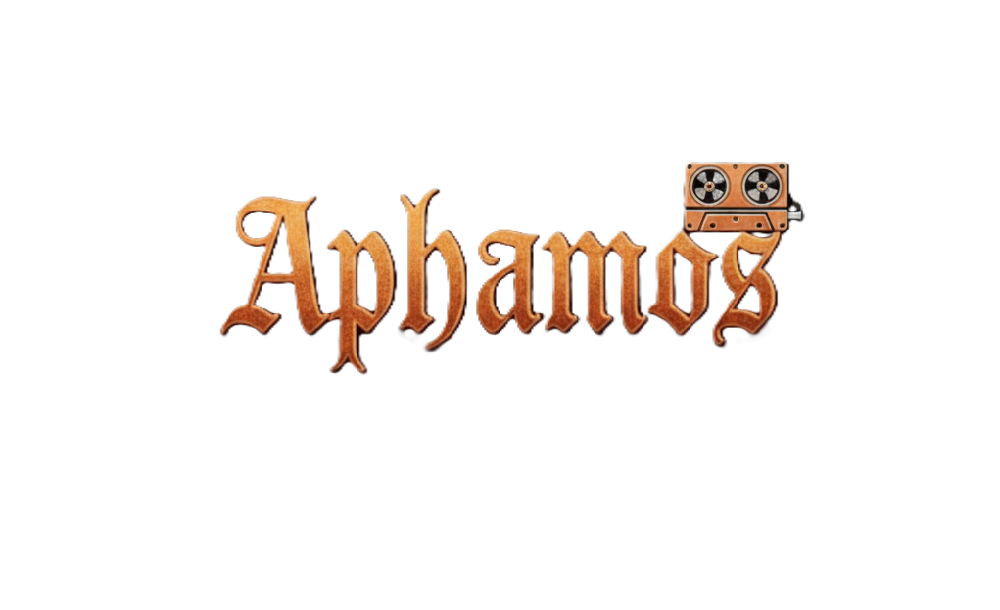
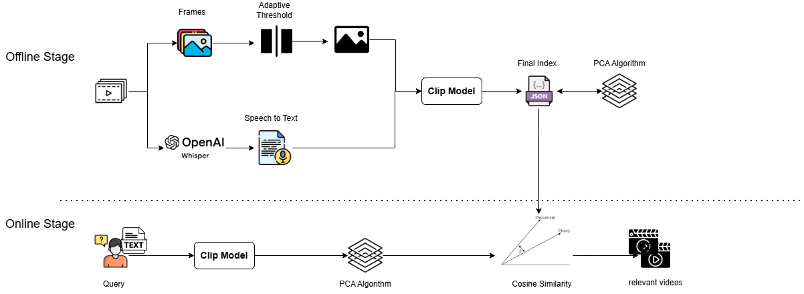

Aphamos
---
---
Aphamos is a Novel Experimental Framework for Text-to-Video Retrieval System.

---



---
### Abstract
---
Video retrieval remains challenging due to limited semantic alignment between queries and videos. In this work, we propose a novel embedding system that enhances cross-modal similarity learning using simple, computationally efficient techniques. Our approach combines histogram-based methods with image and audio embedding to improve similarity and alignment.

---
### Architecture
---


---
### Contributions
---
* Utilizing histogram-based techniques with adaptive  thresholds based on the visual characteristics of the video.

* Incorporating audio transcripts alongside video  frames after dimensionality reduction using PCA.

* Preparing a research paper based on this system to study the impact of audio embedding, dimensionality reduction, and various adaptive thresholding values on the relevance of retrieved videos.

---
### Dataset
---
We use Dataset from [Panda-70M](https://snap-research.github.io/Panda-70M/), And we specially use [Testing](https://drive.google.com/file/d/1BZ9L-157Au1TwmkwlJV8nZQvSRLIiFhq/view?usp=sharing) split. 

---

### Results
---
|R@1|R@5|R@10|MRR|
|---|---|---|---|
|19.0|36.0|44.333|27.905|

>**Note:** Our method achieves competitive performance on Panda-70M.
---
### Requirements
---
- Python 3.9.25
  >**Note:** The code is compatible with Python 3.9.25
   Other versions may lead to unexpected behavior, or incompatibility with required libraries.
- Model: OpenAI CLIP ViT-B/32
  Version: openai/clip-vit-base-patch32 (Hugging Face)
  >**Note:** If you use [Colab](https://colab.research.google.com/), You don't have to download this model.

- Model: OpenAI Whisper Small
  Version: "small" model (v20231117)
  >**Note:** If you use [Colab](https://colab.research.google.com/), You don't have to download this model.    
### Installation
---
Get an Aphamos repository:
```
git clone git@github.com:mazen-altabbaa/Video-Retrieval-System.git
```
Change to the appropriate directory:
```
cd Video-Retrieval-System 
```
Install requirements libraries
```
pip install -r requirements.txt
```
In retrieval.py file, In Settings Class: 
- Put your videos directory path in "videosDir" variable:
   ```
   videosDir = "videos directory path here"
   ```
- Put your models directory path:
   ```
   localClipPath = "clip directory path here"
   localWhisperPath = "whesper directory path here" 
   ```
The system is now ready for execution.

---
### Contact
---
For questions or collaborations:
* **Ahmad**
Email: ahmad2315753@gmail.com
Github: [ahmad-srdah](https://github.com/ahmad-alsrdah)
* **Mazen**
Email: mazenaltabbaa366@gmail.com
Github: [mazen-altabbaa](https://github.com/mazen-altabbaa)
##### You may also open an issue for implementation-related questions.
