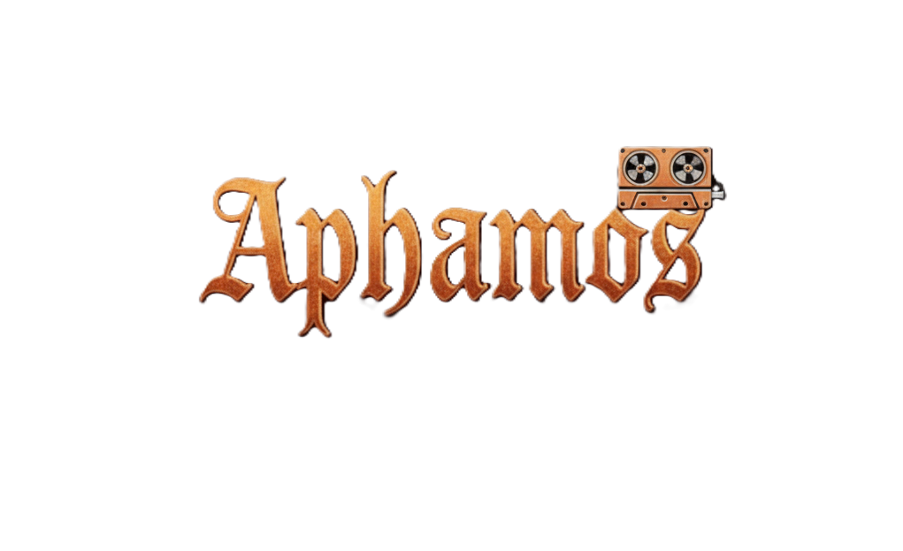
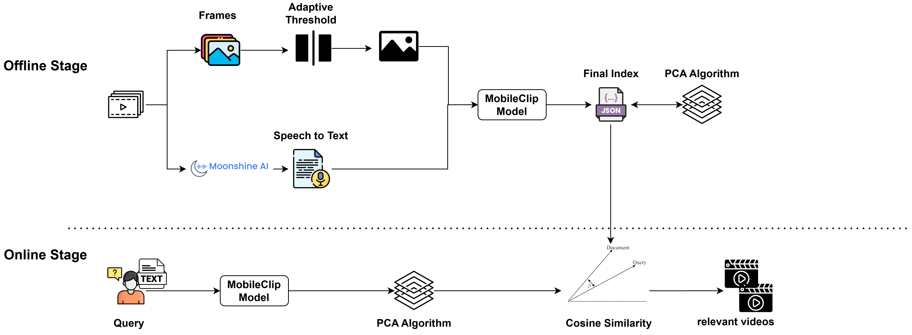
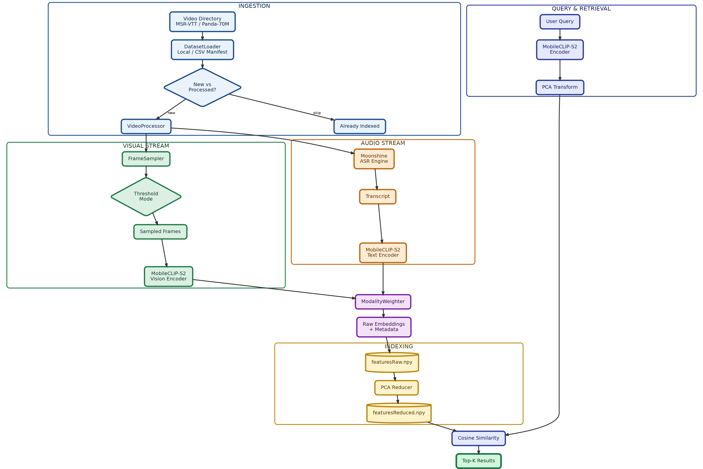

# Aphamos

**A Novel Experimental Framework for Multimodal Text-to-Video Retrieval**



---

## Abstract

Video retrieval remains challenging due to limited semantic alignment between natural language queries and heterogeneous video content. Aphamos proposes a training-free multimodal indexing and retrieval framework that combines histogram-based adaptive frame sampling with dual-stream embedding — encoding both visual frames via MobileCLIP-S2 and audio transcripts via Moonshine ASR. Modality fusion weights are computed dynamically per video using Shannon entropy, allowing the system to adapt to the visual and acoustic characteristics of each clip without any labeled training data.

---

## Pipeline



---

## Architecture



---

## Contributions

- Histogram-based frame selection with four configurable threshold strategies: adaptive, constant, random, and interval-based.
- Dual-stream embedding combining MobileCLIP-S2 visual features and Moonshine ASR transcript embeddings.
- Dynamic entropy-based modality fusion that weighs audio and frame streams per video at indexing time.
- Multi-dimensional PCA reduction (512 → 256 / 128 / 64) stored at index time, enabling zero-cost evaluation across all dimensions.
- Batch matrix-multiplication evaluator supporting R@1, R@5, R@10, MRR, mean query time, and confidence factor across all PCA × modality combinations in a single pass.
- Evaluated on two datasets: Panda-70M (300 videos) and MSR-VTT (300 videos) across five threshold configurations.

---

## Datasets

| Dataset | Split | Videos | Notes |
|---|---|---|---|
| [Panda-70M](https://snap-research.github.io/Panda-70M/) | Test | 300 | Filtered via `panda70m_filtered_exact_match.csv` |
| [MSR-VTT](https://www.microsoft.com/en-us/research/publication/msr-vtt-a-large-video-description-dataset-for-bridging-video-and-language/) | Test-1K | 300 | Downloaded via `yt-dlp`, trimmed to annotated clip range |

---

## Results

### Panda-70M (best configuration: Interval frames selecting, PCA-512, both modalities)

| R@1 | R@5 | R@10 | MRR |
|---|---|---|---|
| 0.637 | 0.803 | 0.853 | 0.708 |

### MSR-VTT (best configuration: Interval frames selecting, PCA-512, both modalities)

| R@1 | R@5 | R@10 | MRR |
|---|---|---|---|
| 0.387 | 0.600 | 0.720 | 0.483 |

> Results are from a training-free system running locally on an RTX 2050 (4 GB VRAM). No fine-tuning or labeled data was used at any stage.

---

## Requirements

- Python 3.12
- PyTorch 2.7.1 + CUDA 12.6
- ffmpeg (system-level, required for audio extraction)

Install Python dependencies:

```bash
pip install -r requirements.txt
```

Models are downloaded automatically on first run and cached locally under `models/` (controlled via `HF_HOME`):

| Model | Source | Purpose |
|---|---|---|
| MobileCLIP-S2 (`datacompdr`) | `open_clip` / HuggingFace | Frame + text embedding |
| Moonshine Base | `UsefulSensors/moonshine-base` | Audio transcription |

---

## Installation

```bash
git clone https://github.com/mazen-altabbaa/Aphamos.git
cd Aphamos
pip install -r requirements.txt
```

Install ffmpeg (Fedora / Ubuntu):

```bash
# Fedora
sudo dnf install ffmpeg

# Ubuntu
sudo apt install ffmpeg
```

---

## Usage

```bash
python main.py
```

On first run the system will prompt for:

```
Videos directory: dataset/Panda70_Dataset
Name this collection: panda_thr5
```

After indexing, choose option **4** to evaluate:

```
Path to eval CSV: dataset/panda70m_filtered_exact_match.csv
```

The evaluator runs all 12 combinations (4 PCA dims × 3 modality modes) in a single batch pass and prints a full results table.

### Menu options

| Option | Action |
|---|---|
| 1 | Use existing index → query or evaluate |
| 2 | Add more videos to existing index |
| 3 | Reset index from scratch |
| 4 | Evaluate (R@K, MRR) across all PCA × modality combinations |

### Config

All parameters are in `config.py`:

```python
thresholdMode: str = "adaptive"   # adaptive | constant | random | interval
initialThreshold: float = 5.0
constantThresholdValue: float = 25.0
minFrameIntervalSec: float = 2.0
maxFramesPerVideo: int = 30
pcaDimension: int = 256
fusionMode: str = "dynamic"       # dynamic | constant
retrievalMode: str = "both"       # both | audio | image
device: str = "cuda"
```

---

## Project Structure

```
Aphamos/
├── main.py                  # Entry point and menu
├── config.py                # System configuration
├── core/
│   ├── frameSampler.py      # Histogram-based frame selection
│   ├── thresholdStrategies.py
│   ├── modalityWeighter.py  # Entropy-based dynamic fusion
│   └── interfaces.py
├── engines/
│   ├── visionEncoder.py     # MobileCLIP-S2 image + text encoder
│   └── asrEngine.py         # Moonshine ASR with multi-chunk sampling
├── index/
│   ├── indexBuilder.py      # Builds and stores all PCA variants
│   └── videoProcessor.py
├── retrieval/
│   └── querySearch.py       # Batch similarity search
├── storage/
│   ├── indexStore.py
│   └── pcaReducer.py        # Per-dimension PCA fit + load
├── dataset/
│   └── datasetLoader.py     # CSV-filtered + local folder loaders
└── test/
    ├── evaluator.py          # Batch multi-combo evaluator
    ├── evalManifestReader.py
    ├── evalMetrics.py
    └── evalReporter.py
```

---

## Computing Environment

All experiments were conducted locally on:

- CPU: AMD Ryzen 5 7535HS (6 cores / 12 threads, up to 4.60 GHz)
- GPU: NVIDIA GeForce RTX 2050 (4 GB VRAM)
- RAM: 8 GB DDR5-4800
- OS: Fedora Linux with KDE Plasma
- Framework: PyTorch 2.7.1 + CUDA 12.6

---

## Contact

For questions or collaborations:

- **Mazen Al-Tabbaa** — mazenaltabbaa366@gmail.com · [mazen-altabbaa](https://github.com/mazen-altabbaa)
- **Ahmad** — ahmad2315753@gmail.com · [ahmad-alsrdah](https://github.com/ahmad-alsrdah)

Open an issue for implementation-related questions.
